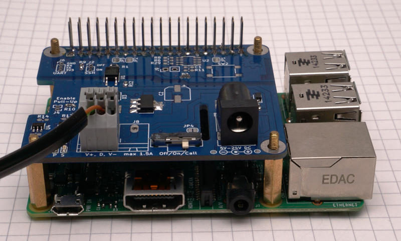
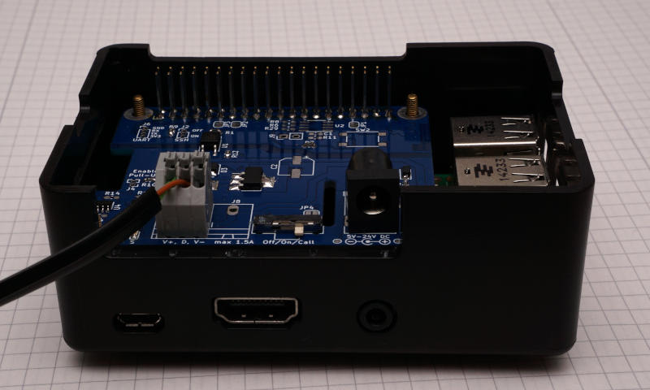
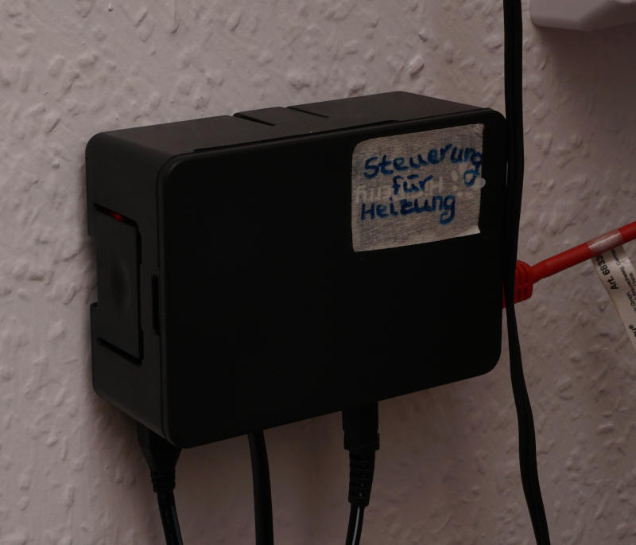

SIP Heating Gateway
====================




This device allows you to control the heating (or any other device) by calling in and using an interactive voice menu. In case of a power loss the last state will be restored as soon as the power is back. The software is build to survive unexpected power losses.

The heart of the system is a Raspberry pi with a custom hat to provide 12V to an external relay. On this Raspberry pi a custom embedded linux is used to to control the 12V via a small shell script. It connects via ethernet to the a SIP server (e.g. a fritzbox router or your isp). The heavy lifting for the SIP connection and the voice menu is done by asterisk, which uses the already mentioned shell script to switch a gpio pin. The linux system is build with buildroot and the hole image image is less than 200MB and boots in a few seconds.

The linux system on the raspberry pi is configured to use the micro sd card as read only storage. This should prevent damage on power failure. The only exception is a persitent partition, which is used to save the current state. This state will be restored in case of a power failure. The partition should also be safe from corruption due to the mount parameters and the infrequent writes.

## Usage

Connect Power (5V via micro-USB and 12V), ethernet and the output to the relay. After bootup the device accepts incoming calls.

Call the device,  wait until pickup and follow the voice instructions:
1. Enter the PIN and press `#`
2. Press `1` to turn the heating on, `2` to turn the heating off, `3` to get the status of the heating
3. Repeat step 2, or hang up

After a timeout the caller will be disconnected automatically.

```
                                               5V (micro USB)
                                                |
                                                v
+-----------------+                      +----------------+              +----------+
| router / switch | SIP (over ethernet)  | Raspberry Pi   | 12V Switched | Relay of |
| e.g. fritzbox   |<-------------------->| (with 12V hat) |------------->| heating  |
+-----------------+                      +----------------+              +----------+
                                                ^
                                                |
                                              12 V
```

## Configuration
The custom embedded system is based on buildroot. The behaviour at a call is controlled by [Asterisk](https://www.asterisk.org/). There are two main configuration files:
 * `/etc/asterisk/sip.conf`
   SIP server configuration
 * `/etc/asterisk/extensions.conf`
   Dialplan (phone menu, pin)

The configuration files can be adjusted by changing the files of the overlay (`br-external/board/raspberrypi2-heating-control/rootfs-overlay`). Asterisk is configured to only use a minimal amount of modules. Modify `/etc/asterisk/modules.conf` if necessary.

There is a watchdog script (`/opt/heatingControl/asterisk_wdog`) that monitors the peers and registry and will restart asterisk in case of failures. It is automatically started at boot via `/etc/init.d/S55asterisk_wdog`. You probably want to stop it to configure asterisk and start it after the finished configuration.

For maintenace and debugging it is possible to connect to the device via a serial connection (115200 8N1) or HDMI. The system is by default read-only. To modify the file system it has to be remounted (`mount -o remount,rw /`). The login data is:

 * username: "root"
 * password: "" (There is no root password. This is no problem, since there is no way to login remotely)


## How to build the sd card image
1. Clone repository (use `--recursive` to get buildroot submodule)
2. Change into software folder (`cd software`)
3. `make BR2_EXTERNAL=$PWD/br-external -C buildroot raspberrypi2-heating-control_defconfig`
4. `make -C buildroot`
5. write `buildroot/output/images/sdcard.img` to sd card (e.g. `dd if=buildroot/output/images/sdcard.img of=/dev/mmcblk0 bs=1M && sync`)

## Hardware
You don't need any special hardware for this. The raspberry pi will just toggle one of the GPIO PINs (see `/opt/heatingControl/controlheating` for details).

The author of this project wants to switch a 12V relay and has designed a hat for this task. This hat is designed to take quite a bit of abuse like e.g. short circuit, reverse power, ESD etc. and can supply 5-24V with up to 1.5A from an external power supply. In practice it should also tolerate higher voltages and currents, but you probably want to check the schematic and datasheets to push the limits. Further it has a manual override switch in case of software issues or a failure of the raspberry pi. Simplified schematic:


Full schematic:


The hardware is designed to fit nicely into a HighPi Case, which has all necessary cutouts and can be mounted on a wall.

 

## Good to know
 * This system uses [Buildroot](https://buildroot.org/) to create a custom embedded system. This provides more flexibility and allows more customization than a stripped down raspbian. The complete image is just a little bigger than 100MB.
 * Connect via 3.3V serial (115200 8N1) or connect an external monitor via HDMI and use a usb keyboard
 * The heating control script is `/opt/heatingControl/controlheating`
 * The root system is read only. It can be mounted as rw (`mount / -o remount,rw`), but this is mainly recommanded for testing and maybe the initial configuration. Every change can be integrated into `br-external`. This way the image can be build in a repeatable way.
 * There is a small persistent storage partition at the sd card. It is mounted at boot via fstab at `/media/persistent/`. The mount options `rw,sync,data=journal,barrier=1,noatime,commit=1` were choosen to avoid data corruption and wear of the sd card. It is only used to store store the current state at `/media/persistent/last_state` and to restore it after a power loss. On every boot `/etc/init.d/S10restorestate` tries to restore the last state. 
 * To debug problems with asterisk it might be useful to connect to a running asterisk in verbose mode: `asterisk -rvvvv`. You can enable SIP debug mode with `sip set debug on`.
 * Any file can be added/overwritten by adding it ot the rootfs overlay at `br-external/board/raspberrypi2-heating-control/rootfs-overlay/`. 
 * The asterisk configuration files can be found at `/etc/asterisk`. The build process automatically deploys the default configuration files. The overlay is used to overwrite them.
    - SIP configuration file: `/etc/asterisk/sip.conf`
    - Dialplan (phone menu, pin): `/etc/asterisk/extensions.conf`
 * The buildroot configuration is based on the raspberry pi 2 configuration. Other version can easily be added. It probably even boots on other raspberry pi versions, but the serial console is most likely broken, due to a hardware differences.
 * eth0 is managed by ifplugd (provided by busybox), which will automatically ifup/ifdown the interface if a network cable is connected/disconnected
 * The dhcp client was configured to run in the background. This is useful if the network link isn't ready when we try to get an ip address. This archived with a custom busybox configuration with the option `CONFIG_IFUPDOWN_UDHCPC_CMD_OPTIONS=-R -b -O search"`. The option `-b` sets udhcpc to run in the background. (`-R` is release on exit, `-O search` enables domain search option RFC 3397)
 * Busybox is configured to ship non default packages:
   - `rx` (in case we want to transfer a file via serial) 
   - `ifplugd` (see above)
 * Aterisk logs to syslog, this avoids filling up our tmpfs. Further cdr (call detail record) is disabled (`/etc/asterisk/cdr.conf`). Busybox rotates syslog for us (CONFIG_FEATURE_ROTATE_LOGFILE)
 * The hardware watchdog of the raspberry pi (bcm2835_wdt) is used to restart the system in case the system locks up. `/etc/init.d/S15watchdog` starts the watchdog at boot and periodically writes to `/dev/watchdog`.

## Overview of files
```
├──audio-gen
├──buildroot
└──br-external
   ├── board
   │   └── raspberrypi2-heating-control
   │       ├── genimage-raspberrypi2-heating-control.cfg
   │       ├── post-build.sh
   │       ├── post-image.sh
   │       └── rootfs-overlay
   │           └── <config files and scripts>
   ├── Config.in
   ├── configs
   │   └── raspberrypi2-heating-control_defconfig
   ├── external.desc
   └── external.mk
```

 * `audio-gen` infos about the audio file generation for the interactive voice menu
 * `buildroot` git submodule of [buildroot](https://buildroot.org/)
 * `br-external` external overlay module for buildroot with all configuration and software files to build our custom linux

## Test cases

After I have made changes, I like to test the following cases to make sure everything works (for now manually, but it would be an interesting idea to automate them).

 * Check basic functionality
   1. Start Rasbperry Pi with everything connected (including network)
   2. Call and interact with the voice menu
   3. Check authentication, automatic timeout, turn heating on/off, check status of heating
 * Check if state is restored on power loss
   1. Start Rasbperry Pi with everything connected (including network)
   2. Turn heating on
   3. Disconnect power, reconnect power
   4. Check if heating is automatically turned on while booting
   5. Repeat for heating off
 * Simulate power outage
   1. Disconnect Raspberry Pi AND the network infrastructure power
   2. Reconnect everything to power
   3. Check if Raspberry Pi can be called
 * Start Raspberry Pi without network and connect it later
   1. Start Raspberry Pi without network connection
   2. Wait 5 minutes
   3. Connect network connection
   4. Wait 5 minutes (asterisk watch dog will restart asterisk after like 4 minutes)
   5. Check if Raspberry Pi can be called

The previous checks are usually enough, but here are some more:

 * Check ifplugd
   1. Disconnect ethernet cable from running Pi
   2. Check if `ifconfig` if ip address is gone (takes a few seconds)
   3. Reconnect ethernet cable
   4. Check with `ifconfig` if we get a dhcp lease
 * Check asterisk watchdog
   1. Note current PID of asterisk: `pgrep -x asterisk`
   2. Disconnect ethernet cable from running Pi
   3. Check if watchdog complains at syslog (`/var/log/messages`), watchdog only checks asterisk once every 60 seconds
   4. Check if watchdog restarts asterisk after about 4 minutes by comparing the PID
 * Check if syslog is rotated
   1. run `while true; do logger hello; done` for some moments
   2. check if `/var/log/messages` is rotated to `/var/log/messages.0` and if file size is small (like 200kB)


## Enhancement Ideas
 * Add an ssh server to make maintenance easier (at the moment you have to connect via serial or connect your Keyboard and display directly). This ssh server could be enabled by a jumper to enable a maintenance mode.
 * Don't run asterisk as root. This sounds simple in theory, but the user needs permissions to write to /sys/class/gpio. The best way to archive this is probably to use `mdev` together with the `devtmpfs`. On the other hand it won't enhance the security a lot, since asterisk is the only service on this device.
